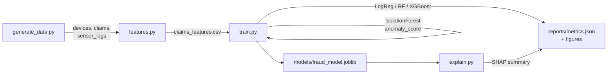
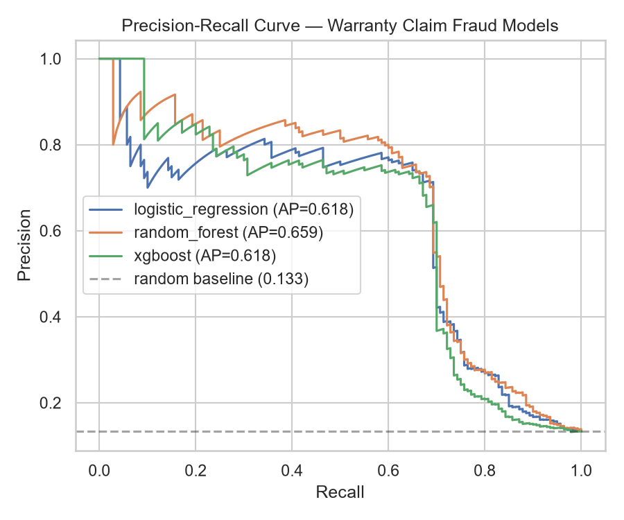
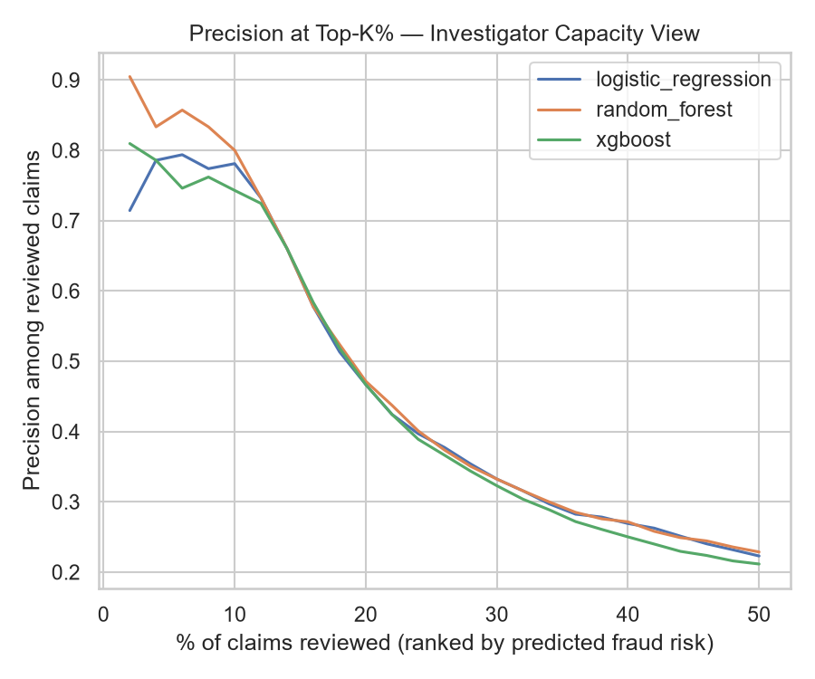
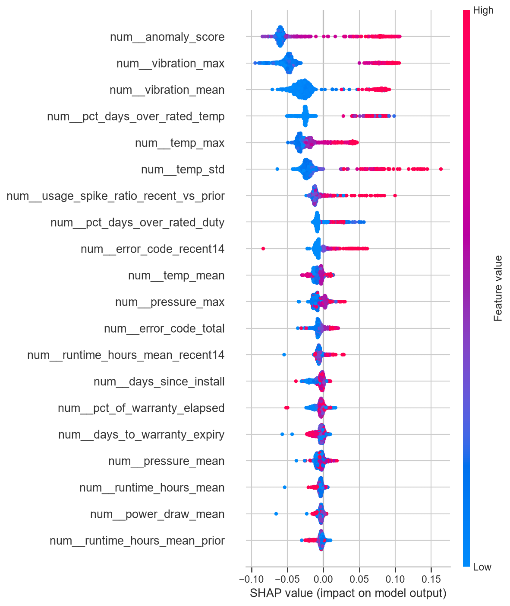

# Warranty Claim Fraud Detection via IoT Sensor Logs

Flag fraudulent warranty claims on IoT-connected smart appliances by mining the
device's own sensor telemetry, not just the claim form. Built as an end-to-end,
reproducible fraud-analytics pipeline: synthetic-but-realistic data generation
&rarr; time-series feature engineering &rarr; unsupervised anomaly scoring &rarr;
supervised classification &rarr; SHAP explainability &rarr; an
investigator-capacity evaluation.

**[Read the full walkthrough notebook &rarr;](notebooks/01_eda_and_modeling.ipynb)**

## The problem

A manufacturer of smart water heaters equips every unit with sensors that stream
a rolling 90-day buffer of telemetry (temperature, pressure, vibration, runtime,
power draw, error codes) to the cloud. When a customer files a warranty claim,
that telemetry becomes evidence — but most warranty teams never systematically
mine it. This project turns it into a ranked, explainable worklist for a fraud
review team, targeting the patterns that actually cost manufacturers money:

- **Misuse claimed as a defect** — the device was run well outside its rated
  spec (voiding the warranty), then reported as a spontaneous failure.
- **Pre-existing damage** — anomalous readings present from the very start of
  the observation window, inconsistent with a "sudden" failure.
- **Tampering** — telemetry reporting is disabled (a blackout) right before a
  spike and a claim, consistent with someone hiding what actually happened.
- **Timing games** — usage suddenly spikes in the final days before warranty
  expiry, then a claim follows immediately.

## Why synthetic data

There is no public dataset of labeled warranty-fraud IoT telemetry (for obvious
reasons — it's commercially sensitive). [`src/generate_data.py`](src/generate_data.py)
implements a transparent, documented generative process instead: customers,
devices, claims, and daily sensor windows are simulated from named usage
scenarios with realistic label noise (~3–4% of claims are mislabeled in either
direction, mimicking imperfect real-world fraud investigations). Every scenario
and its telemetry signature is written out in code and in the module docstring
— nothing is a black box. Ground-truth fields used only to *build* the
simulation (`true_scenario`) are excluded from modeling; see
[`src/features.py`](src/features.py) for the exact feature set used as model
input.

## Pipeline



1. **`generate_data.py`** — simulates 3,200 customers, ~4,200 devices, ~4,200
   warranty claims, and their 90-day pre-claim telemetry windows.
2. **`features.py`** — aggregates each claim's telemetry into investigator-style
   features (uptime %, longest telemetry gap, % of days over rated spec, a
   recent-vs-prior usage-spike ratio, customer claim history, etc.).
3. **`train.py`** — fits an `IsolationForest` on training-set telemetry to
   derive an `anomaly_score`, then trains and compares Logistic Regression,
   Random Forest, and XGBoost classifiers with class-imbalance handling.
   Saves the best model, metrics, and plots.
4. **`explain.py`** — SHAP `TreeExplainer` on the winning model, so a flagged
   claim comes with a "why," not just a score.

## Results

Held-out test set, 1,050 claims (13.3% fraud rate):

| model | ROC-AUC | PR-AUC | precision @ top 5% | precision @ top 10% | precision @ top 20% |
|---|---|---|---|---|---|
| **Random Forest (best)** | **0.843** | **0.659** | **0.830** | **0.800** | 0.471 |
| Logistic Regression | 0.832 | 0.618 | 0.793 | 0.781 | 0.467 |
| XGBoost | 0.801 | 0.618 | 0.774 | 0.743 | 0.467 |

The random-forest baseline fraud rate is 13.3%; ranking claims by predicted
risk and reviewing only the **top 10%** catches claims that are fraudulent
**80% of the time** — a ~6x lift over reviewing claims at random. That's the
operational pitch: a fraud team with limited review capacity gets a queue that
is mostly worth their time instead of a coin flip.

At the default 0.5 threshold: precision 0.73 / recall 0.69 / F1 0.71 on the
fraud class (see [`reports/metrics.json`](reports/metrics.json) for the full
breakdown and confusion matrix).





The SHAP summary lines up with how the fraud was simulated: `anomaly_score`,
`vibration_max`, `vibration_mean`, and `pct_days_over_rated_temp` dominate —
telemetry that deviates from a device's own rated spec is a stronger signal
than anything on the claim form itself.

## Repo layout

```
src/
  generate_data.py   synthetic data generator (documented scenarios + label noise)
  features.py        per-claim feature engineering from raw telemetry
  train.py           IsolationForest + LogReg/RF/XGBoost training & evaluation
  explain.py         SHAP explainability for the winning model
notebooks/
  01_eda_and_modeling.ipynb   full narrative walkthrough (pre-executed)
data/
  raw/         generated locally by generate_data.py (gitignored — ~26MB, regenerate it)
  processed/   claims_features.csv (committed — small, one row per claim)
  samples/     a handful of full 90-day telemetry windows (committed, for the notebook)
reports/
  figures/     saved evaluation plots
  metrics.json full evaluation output
models/        trained model artifacts (joblib)
```

## Running it

```bash
python -m venv .venv
source .venv/bin/activate  # .venv\Scripts\activate on Windows
pip install -r requirements.txt

python src/generate_data.py   # writes data/raw/*.csv
python src/features.py        # writes data/processed/claims_features.csv
python src/train.py           # writes models/, reports/metrics.json, reports/figures/
python src/explain.py         # writes reports/figures/shap_summary.png
```

Or open [`notebooks/01_eda_and_modeling.ipynb`](notebooks/01_eda_and_modeling.ipynb)
directly — it's committed pre-executed with all outputs, so it renders fully on
GitHub with no setup required.

## Limitations & next steps

- Labels are simulated. A production version needs investigator-confirmed
  outcomes to validate against and recalibrate on.
- Fraud scenarios here are hand-authored; real fraud patterns drift, so a
  deployed model would need periodic retraining and drift monitoring.
- Thresholding is currently accuracy/PR-AUC driven. A real deployment should
  set the operating point from an explicit cost model (false-accusation cost —
  customer trust, legal exposure — vs. missed-fraud payout cost).

## Tech stack

Python, pandas, NumPy, scikit-learn, XGBoost, SHAP, matplotlib/seaborn, Jupyter.
